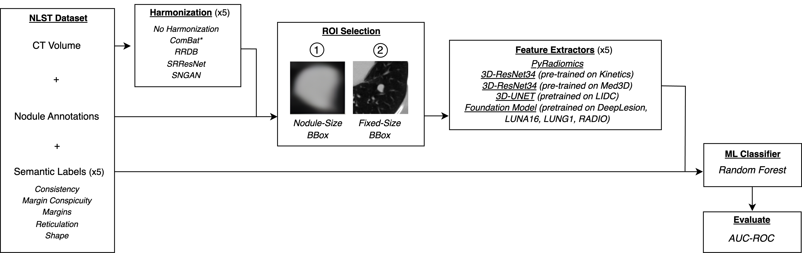

## <h2 align="center"> Evaluating the Impact of CT Harmonization on Pretrained Deep and Radiomic Features for Semantic Lung Nodule Feature Classification

Anil Yadav<sup>1,2</sup>, Nathan Tran<sup>2</sup>, Jeffrey Feng<sup>2</sup>, Rina Ding<sup>2</sup>, Stephen Park<sup>2</sup>, Ashley E. Prosper<sup>2</sup>, Denise R. Aberle<sup>1,2</sup>, Hossein Tabatabaei<sup>2</sup>, and William Hsu<sup>1,2</sup>

1. Department of Bioengineering, Samueli School of Engineering, University of California, Los Angeles, 90095, CA,
USA
2. Medical & Imaging Informatics Group, Department of Radiological Sciences, David Geffen School of Medicine,
UCLA, Los Angeles, 90095, CA, USA

The study aimed to evaluate the prognostic differences between pretrained deep features and radiomic features in classifying semantic lung nodule features, while also examining how CT harmonization affects predictive performance. We harmonized 875 CT scans retrospectively collected as part of the National Lung Screening Trial using three image-level methods, including two convolutional neural networks and one generative adversarial network, and one feature-level method, ComBat. The harmonized scans were processed through four deep feature extractors and a radiomic pipeline to generate nodule-specific features using two approaches: a nodule-size bounding box (bbox) extracted from contour annotations provided by in-house radiologists, and a simplified fixed-size bbox centered on the nodule. A Random Forest model is trained for each feature extractor to classify five lung nodule semantic features with a 10-fold cross-validation approach. For each semantic feature, we compared the difference in area under the receiver operating characteristic curve (AUC-ROC) across all feature extractors, with no harmonization as our baseline. Using the nodule-size bbox feature extraction approach, the best AUC-ROCs for nodule consistency, margin conspicuity, margins, reticulation, and shape classification were achieved using *radiomic* features: 0.883 ± 0.052 (mean ± 95% CI), 0.792 ± 0.053, 0.761 ± 0.025, 0.771 ± 0.024, and 0.759 ± 0.051, respectively. Harmonization did not lead to a significant improvement in *radiomic* features performance. On the contrary, when using the fixed-size bbox approach, the best AUC-ROC for nodule consistency, margins, and shape was achieved using *Kinetics*, and for margin conspicuity and reticulation, using *Med3D*. Harmonization significantly benefited deep feature extractors in mitigating inter-scanner variability, with consistency and margin conspicuity demonstrating better generalizable performance after harmonization than other semantic features.

## 🖍 Study Design


<p align="center">
  
</p>


## Step 1: Feature Extraction 

### 📁 Setup Data

We provide few [sample data](https://drive.google.com/drive/folders/1v4RT6ViKGjb8UUwXaZif1X-QtC8J4Xym?usp=drive_link) to  follow through the tutorial. For easier navigation, keep the downloaded data in the same folder as the code.

**Input Data Formats:**
Current feature extraction pipeline only supports data in [NIfTI](https://nipy.org/nibabel/) (🔗) format.

**Data Structure:**
Organize your data in the following directory structure:
```
├── 📂 PID_1
│   ├── image.nii.gz
│   ├── lesion.nii.gz
├── 📂 PID_2
│   ├── image.nii.gz
│   ├── lesion.nii.gz
│........
```
Set up path to images and lesion segmentations in the `filePath_radFeat.csv` and `filePath_deepFeat.csv` accordingly. Each row should be a unique PID.

> Note: The deep features are extracted using two different ROI sizes: Using a `nodule-size` bounding box crop, and a `fixed-size` (64x64x32) bounding box crop. The code expect the crops as input. We provide examples of both types of crops in the [sample data](https://drive.google.com/drive/folders/1v4RT6ViKGjb8UUwXaZif1X-QtC8J4Xym?usp=drive_link) folder. Arrange separate CSV files to provide paths for each type of crop. 

Download the weights for the [deep models](https://drive.google.com/drive/folders/1V80vew64ewm-3yzAasexdNdibHQXr5Wq?usp=drive_link), and put the weights inside ***./deep/weights*** folder.

> Note: The feature extraction component does not currently support extracting features from foundation model. To achieve this, please follow the instructions provided [here](https://github.com/AIM-Harvard/foundation-cancer-image-biomarker).


###  🖥 Usage Instructions
 **Run Docker in Interactive Mode**
```bash
docker run --name semantic_analysis \
           --gpus all \
           -it --rm \
           -v $PWD:/workspace/semantic_analysis \
           -w /workspace/semantic_analysis \
           -v /etc/localtime:/etc/localtime:ro \
           litou/mii-pytorch:20.11 \
           bash -c "pip install nibabel --upgrade scikit-learn==0.24.2 && bash"
```
This runs a container named ***semantic_analysis*** using the `litou/mii-pytorch:20.11` image with GPU support and mounts the current working directory into the container.

**To extract radiomic features, Run:**
```
python get_radiomic.py --input_csv ./filePath_radFeat.csv --output_csv ./extracted_features/radiomics.csv
```
***Arguments***
- *--input_csv* = CSV file containing the paths to the images and lesion segmentations
- *--output_csv* = Output feature CSV path

**To extract deep features, Run:**
```
python get_deep.py --gpu_id 3 --mode resnet_34_kinetics --input_csv ./filePath_deepFeat.csv --output_csv ./extracted_features/resnet_kinetics.csv --dataroot ./
```
***Arguments***
- *--gpu_id* = GPU to run inference on
- *--mode* = Feature extractor model. Options are `resnet_34_kinetics`, `resnet_34_med3d`, or `unet_lidc`
- *--input_csv* = CSV file containing the paths to the cropped images and lesion segmentations. Use separate CSV files for each type of crop.
- *--output_csv* = Output feature CSV path
- *--dataroot* = Folder containing the cropped images and lesion segmentations

**To generate semantic label, Run:**
```
python semantic_classification.py --task consistency --bbox orig --extractor radiomic --feature_csv ./extracted_features/radiomics.csv --output_csv ./semantic_predictions/og_radiomic_consistency.csv 
```
***Arguments***
- *--task* = Semantic classification task. Options are `consistency`, `conspicuity`, `reticulation`, `shape`, or `margins`
- *--bbox* = Cropping bounding box approach. Options are `orig` (i.e., nodule-size) or `fixed` (i.e., fixed-size)
- *--extractor* = Extractor model used when extracting features. Options are `radiomic`, `kinetics`, `med3d`, `lidc`, `fm` (i.e., Foundation model)
- *--feature_csv* = CSV file of the extracted features
- *--output_csv* = Output semantic lable CSV path

> Note: It is important to select the  arguments here based on how the features (in **Step 1**) were generated.

